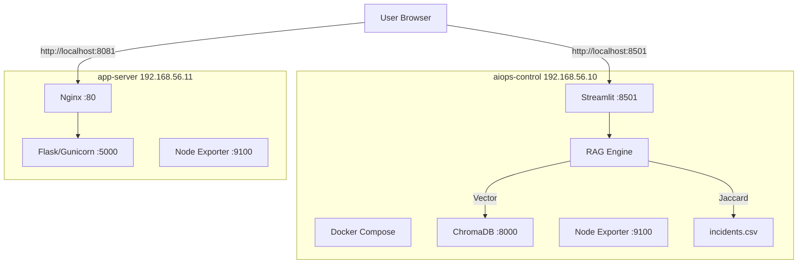

# 09 — Bonus Lecture: DORA Metrics, Architecture, RFC & AIOps Improvement

This is a **student-driven exercise**. You will think like an SRE/Platform Engineer and produce 4 deliverables based on everything you built in Module 1.

---

## Deliverable 1: DORA Metrics for This Module

**DORA metrics** (DevOps Research and Assessment) measure team performance across 4 dimensions. Apply them to what you've done in Module 1.

### Your Task

Fill in this table based on your actual Module 1 experience:

| DORA Metric | Definition | Your Measurement |
|---|---|---|
| **Deployment Frequency** | How often did you deploy changes? | Count: How many times did you run `vagrant up`, `docker compose up`, or restart a service? |
| **Lead Time for Changes** | Time from "I want to change something" to "it's running" | Measure: From editing `flask_app.py` to seeing the change via `curl` — how long? |
| **Change Failure Rate** | What % of your changes caused a failure? | Count: How many times did a `vagrant provision` or `docker compose up` fail on first try? |
| **Mean Time to Recovery (MTTR)** | How fast did you recover from the Break/Fix exercises? | Time: From "I ran the break command" to "I verified the fix" — stopwatch it. |

### DORA Performance Tiers

| Tier | Deploy Freq | Lead Time | CFR | MTTR |
|---|---|---|---|---|
| **Elite** | Multiple/day | < 1 hour | < 5% | < 1 hour |
| **High** | Weekly–Monthly | 1 day – 1 week | 5–10% | < 1 day |
| **Medium** | Monthly–Quarterly | 1 week – 1 month | 10–15% | < 1 week |
| **Low** | > Quarterly | > 1 month | > 15% | > 1 month |

### Questions to Answer

1. Where does your Module 1 lab experience fall on the DORA scale?
2. What was your biggest bottleneck in lead time? (downloading images? debugging? network issues?)
3. If you had to do this 100 times (like in production), what would you automate first?

---

## Deliverable 2: Architecture Diagram

Draw the **complete architecture** of your Module 1 lab environment. This should be a diagram you could show in a design review.

### Requirements

Your diagram must include:

- [ ] Both VMs with IP addresses and hostnames
- [ ] All services running on each VM (Nginx, Flask, Gunicorn, Docker, Streamlit, ChromaDB, Node Exporter)
- [ ] Port numbers for each service
- [ ] Data flow arrows (how does a user request reach Flask? How does Streamlit talk to ChromaDB?)
- [ ] Network boundaries (host-only network, port forwarding to host)
- [ ] The RAG data flow: query → tokenize → search → results

### Suggested Tools

| Tool | Type | Link |
|---|---|---|
| draw.io / diagrams.net | Free, browser-based | https://app.diagrams.net |
| Excalidraw | Whiteboard style | https://excalidraw.com |
| Mermaid | Code-based diagrams | In any markdown viewer |
| ASCII art | Terminal-friendly | `graph-easy` or hand-drawn |

### Example Mermaid Diagram (starting point)



**Your task**: Expand this into a production-quality architecture diagram.

---

## Deliverable 3: RFC (Request for Comments)

Write an **RFC document** proposing improvements to this lab infrastructure. This is a real SRE practice — before making changes, you write an RFC that your team reviews.

### RFC Template

```markdown
# RFC: [Title — e.g., "Add Database Server and Centralized Logging to AIOps Lab"]

## Status: Draft
## Author: [Your Name]
## Date: [Today]

## Summary
One paragraph: what you're proposing and why.

## Motivation
- What problem does this solve?
- What incident or limitation triggered this RFC?
- Reference specific Break/Fix exercise failures or gaps you observed.

## Proposal
Describe your proposed changes:
1. What new VMs/services would you add?
2. What configuration changes?
3. What new tools or software?

## Architecture Changes
Include a before/after architecture diagram.

## Risk Assessment
- What could go wrong?
- What's the blast radius if your change fails?
- How do you rollback?

## Alternatives Considered
- What other approaches did you evaluate?
- Why did you choose this one?

## Action Items
- [ ] Step-by-step implementation plan
- [ ] Who reviews this RFC?
- [ ] Timeline

## Open Questions
- Questions that need team input before proceeding
```

### RFC Ideas (pick one or write your own)

1. **"Add a db-server VM with MySQL for persistent incident storage"** — Replace CSV with a real database. How does this change the RAG architecture?
2. **"Implement centralized logging with Loki"** — Collect logs from both VMs into one place. What agent runs where?
3. **"Add auto-remediation webhook"** — When an alert fires, automatically restart the failed service. What's the risk?
4. **"Replace Jaccard with full vector search pipeline"** — ChromaDB + Sentence-Transformers + LLM. What compute resources are needed?

---

## Deliverable 4: AIOps Improvement Proposal

Think about the Break/Fix exercises you did. Now propose how **AI-powered operations** could have detected, diagnosed, or fixed each issue **automatically**.

### Your Task

Fill in this table for each Break/Fix exercise:

| Exercise | Manual Steps You Took | How AIOps Could Help | Specific Tool/Technique |
|---|---|---|---|
| Nginx stopped | `systemctl status`, `systemctl start` | Auto-detect service down via metric drop, auto-restart via Ansible webhook | Prometheus alerting + Alertmanager webhook + Ansible playbook |
| Disk full | `df -h`, `du -sh`, `rm` | Predict disk full 2 days ahead using linear regression on disk usage trends | Time-series forecasting (Module 9) |
| Flask killed | `systemctl status`, check 502, restart | Anomaly detection on HTTP error rate spike, correlate with process death event | Isolation Forest (Module 5) + Event Correlation (Module 8) |
| Container stopped | `docker compose ps`, `start` | Health check failure → auto-restart policy (Docker already does this with `restart: always`) | Docker restart policies + container health checks |
| CPU stress | `top`, `pkill` | Detect anomalous CPU pattern, identify rogue process, auto-kill or throttle | Anomaly detection + auto-remediation (Module 10) |

### Deeper Questions

1. **Which of these should be auto-remediated vs. human-approved?** Not everything should be automated — deleting data, scaling down, or security actions need human approval.

2. **What's the risk of false positives?** If your anomaly detector flags normal weekend traffic as anomalous and triggers auto-remediation, what's the blast radius?

3. **How would you build a confidence score?** Before auto-remediating, the system should calculate: "I'm 85% confident this is the same failure pattern as Incident #5." What inputs would you use?

4. **Design a feedback loop**: After auto-remediation runs, how do you verify it actually fixed the problem and didn't make it worse?

### Proposal Format

Write a 1-page proposal titled: **"AIOps Improvement Plan for the Module 1 Lab"** covering:
- Top 3 improvements you'd implement (ranked by impact vs effort)
- For each: what data you need, what model/technique you'd use, and what the expected outcome is
- A simple diagram showing the automation flow: `Detect → Validate → Act → Verify`

---

## Submission Checklist

- [ ] **DORA Metrics table** — filled with your actual measurements from Module 1
- [ ] **Architecture diagram** — complete with all services, ports, and data flows
- [ ] **RFC document** — following the template, proposing one infrastructure improvement
- [ ] **AIOps Improvement Proposal** — mapping Break/Fix exercises to AI-powered solutions

---

## Why This Matters

In real SRE teams:
- **DORA metrics** are tracked quarterly to measure team health
- **Architecture diagrams** are required for every service in the catalog
- **RFCs** are how you propose changes without causing chaos
- **AIOps proposals** are how you justify investment in AI tooling to management

These are the artifacts that separate a junior ops engineer from a senior SRE.
