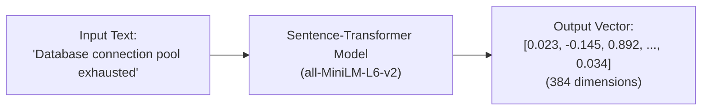
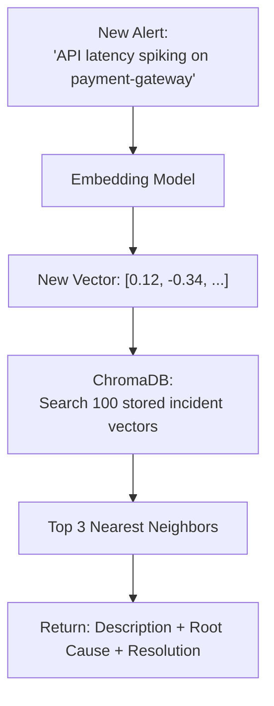

# 01 — Deep Dive into Embeddings and Vector Search

In Module 1, we previewed ChromaDB as a bonus. Now let's understand **why** it works and **how** it's a game-changer for IT operations.

---

## The Problem with Keyword Search (Jaccard)

In Module 1, our Jaccard engine matched incidents based on **exact word overlap**. Here's where it fails:

| Your Alert Says | Historical Incident Says | Jaccard Match? | Same Problem? |
|---|---|---|---|
| "Database connection pool exhausted" | "Too many DB clients connected, reaching max_connections" | ❌ No (different words) | ✅ Yes |
| "Server running out of memory slowly" | "Memory usage climbing steadily reaching 95% over 48 hours" | ❌ No | ✅ Yes |
| "Users can't log in" | "Authentication service returning 401 errors" | ❌ No | ✅ Yes |
| "CPU usage very high" | "Processor pegged at 99% due to runaway cron" | ❌ Weak | ✅ Yes |

**The root problem:** Jaccard only sees **words**, not **meaning**.

---

## The Solution: Embeddings

Embeddings solve this by converting text into an array of numbers (a **vector**) that represents the *semantic meaning* of the text.

### How It Works



1. You pass the text to a model (like `all-MiniLM-L6-v2` via `sentence-transformers`).
2. The model outputs a high-dimensional vector (an array of **384 numbers**).
3. Texts with similar meanings end up **close to each other** in this 384-dimensional space.

### Visualizing Vectors (Simplified to 2D)

Imagine we plot incident descriptions on a 2D map. Similar incidents form clusters:

```
    ▲ Dimension 2
    │
    │   ★ "DB connection pool exhausted"
    │  ★ "Too many DB clients connected"      ← Database Cluster
    │ ★ "MySQL max_connections reached"
    │
    │                    ● "Memory leak in Java service"
    │                   ● "OOM killer terminated process"    ← Memory Cluster
    │                  ● "Server running out of RAM"
    │
    │                                    ■ "SSL cert expired"
    │                                   ■ "HTTPS not working"    ← Certificate Cluster
    │
    └──────────────────────────────────────────────► Dimension 1
```

A new alert like **"DB is slow, connections failing"** would land right next to the Database Cluster — even without sharing exact words!

### Cosine Similarity

To find the closest match, the database calculates the **angle** between two vectors:
- **Cosine similarity = 1.0** → Identical meaning
- **Cosine similarity = 0.0** → Completely unrelated
- **Cosine similarity ≈ 0.85** → Very similar (this is what we want in AIOps)

---

## Vector Databases (ChromaDB)

A vector database like **ChromaDB** is optimized to store millions of these vectors and perform "Nearest Neighbor Search" extremely fast.

### The Full Pipeline



When a new incident occurs:
1. The new incident text is converted into a vector.
2. ChromaDB compares this vector against all stored incident vectors.
3. It instantly retrieves the **Top K** closest matches (default: 3).

---

## Jaccard vs Vector Search — Summary

| Feature | Jaccard (Module 1) | Vector Search (Module 2) |
|---|---|---|
| **Method** | Word overlap counting | Semantic meaning comparison |
| **Handles synonyms?** | ❌ No | ✅ Yes |
| **Handles different phrasing?** | ❌ No | ✅ Yes |
| **Speed** | Very fast (simple set math) | Fast (optimized ANN search) |
| **Accuracy for Ops** | Low — misses most semantic matches | High — finds meaning, not just words |
| **Dependencies** | None (pure Python) | `sentence-transformers`, `chromadb` |
| **Use case** | Quick prototype / exact keyword filtering | Production incident matching |

---

## Lab: Setting Up the Data

Before we can do Vector Search, we need data. We have provided a script that generates realistic IT ops incidents.

### Step 1: Generate the Data

Inside your `aiops-control` VM, navigate to the lab directory and run:

```bash
cd /opt/module2-lab
python3 generate_incidents.py
```

You should see:
```
Successfully generated incidents.csv with 100 records.
```

### Step 2: Review the Data

```bash
head -5 incidents.csv
```

You will see columns for `id`, `timestamp`, `service`, `severity`, `description`, `root_cause`, and `resolution`.

| Column | Role in RAG Pipeline |
|---|---|
| `description` | This gets **embedded** into a vector and stored in ChromaDB |
| `root_cause` | This gets **retrieved** as context when a match is found |
| `resolution` | This gets **retrieved** and fed to the LLM for the RCA report |

### Step 3: Count and Verify

```bash
wc -l incidents.csv
# → 101 (100 incidents + 1 header row)

# Check unique services
cut -d',' -f3 incidents.csv | sort | uniq -c | sort -rn
```

---

## What's Next

In the next lesson, we will **containerize** this entire setup using Docker, so the assistant runs as a proper service rather than a loose script.
