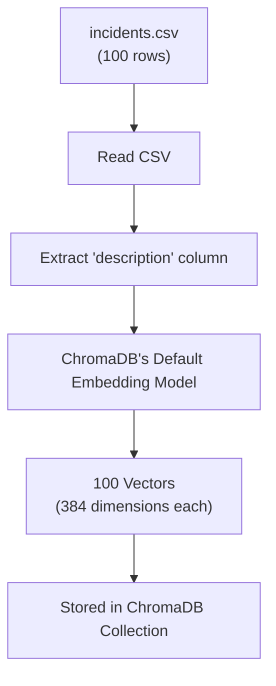
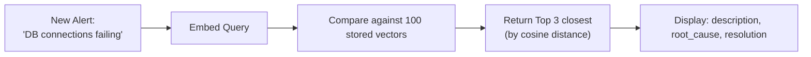

# 03 — ChromaDB Vector Search Lab

In this lesson, we walk through the vector search code inside `app.py` and run a hands-on comparison between Module 1's Jaccard engine and Module 2's ChromaDB engine.

---

## The Code Walkthrough

Open `app.py` in your editor (or view it inside the container). Here is what each section does:

### Section 1: Loading Data into ChromaDB

```python
def load_and_embed(csv_path: str = "incidents.csv"):
    client = chromadb.EphemeralClient()            # In-memory database (no persistence)
    collection = client.create_collection("incidents")  # Create a "table" for incidents
    
    # Read CSV and add documents to ChromaDB
    collection.add(
        documents=[inc["description"] for inc in incidents],   # Text to embed
        metadatas=[{...}],                                      # Extra data to retrieve
        ids=[inc["id"] for inc in incidents],                   # Unique IDs
    )
```

### What Happens Under the Hood



When you call `collection.add(documents=[...])`, ChromaDB automatically:
1. Takes each description string
2. Passes it through its built-in embedding model
3. Converts it to a 384-dimensional vector
4. Stores the vector + metadata together

### Section 2: Querying ChromaDB

```python
def search_chroma(query: str, collection, top_k: int = 3):
    results = collection.query(
        query_texts=[query],     # Your new alert text
        n_results=top_k,         # How many matches to return
    )
```



### Section 3: The Distance Score

Each result includes a `distance` value:
- **Distance = 0.0** → Exact match (identical text)
- **Distance < 0.5** → Strong semantic match (very relevant)
- **Distance 0.5–1.0** → Weak match (possibly related)
- **Distance > 1.0** → Not relevant

---

## Lab: Jaccard vs Vector Search Comparison

This is the key exercise of Module 2. You will run the **same 5 queries** through both search engines and record the results.

### Setup: Access Module 1 and Module 2 Side-by-Side

**Module 1 (Jaccard):** If your Module 1 RAG demo is still running:
```bash
# Check Module 1 container
docker compose -f /opt/rag-demo/docker-compose.yml ps
# Access at http://localhost:8501 (if port isn't conflicting)
```

If Module 1 uses the same port, temporarily stop it:
```bash
docker compose -f /opt/rag-demo/docker-compose.yml down
```

**Module 2 (Vector):** Your Module 2 container at `http://localhost:8501`

### The Test: Run These 5 Queries

Fill in this table as you go:

| # | Query | Jaccard Top Match | Jaccard Score | ChromaDB Top Match | ChromaDB Distance | Better Engine |
|---|---|---|---|---|---|---|
| 1 | "database connection pool exhausted" | _(record)_ | _(record)_ | _(record)_ | _(record)_ | _(record)_ |
| 2 | "server running out of memory slowly" | _(record)_ | _(record)_ | _(record)_ | _(record)_ | _(record)_ |
| 3 | "users can't log in to the website" | _(record)_ | _(record)_ | _(record)_ | _(record)_ | _(record)_ |
| 4 | "the billing microservice JVM is struggling" | _(record)_ | _(record)_ | _(record)_ | _(record)_ | _(record)_ |
| 5 | "disk is almost full on the web server" | _(record)_ | _(record)_ | _(record)_ | _(record)_ | _(record)_ |

### What to Look For

1. **Query 1** should match well on both (shared keywords). ChromaDB should still win on quality.
2. **Query 3** is the killer test — "users can't log in" has **zero keyword overlap** with "authentication failure." Jaccard will miss it; ChromaDB should find it.
3. **Query 4** uses Java jargon ("JVM") — ChromaDB understands that JVM relates to Java memory/CPU issues.

---

## Understanding the Results

### When Jaccard Wins
- Exact keyword matches (e.g., searching for "nginx 502" when the incident says "nginx 502")
- Very short queries with precise terminology
- Zero-dependency simplicity

### When ChromaDB Wins
- Different phrasing for the same problem (synonyms, jargon)
- Cross-service pattern recognition
- Natural language queries from non-technical users (e.g., "the website is slow")

### The Verdict

For production AIOps, **Vector Search is essential**. Real-world alerts come from different monitoring tools with different terminology. An SRE might describe the same problem differently than a Datadog alert. ChromaDB handles this; Jaccard doesn't.

---

## Concepts

| Concept | What It Means |
|---|---|
| **EphemeralClient** | ChromaDB runs in-memory. Data is lost when the container restarts. Use `PersistentClient` for production |
| **Collection** | A group of vectors — like a table in SQL |
| **document** | The text that gets embedded (in our case, the incident description) |
| **metadata** | Extra fields stored alongside the vector (root_cause, resolution, severity) |
| **query_texts** | The input text to search for — ChromaDB embeds it and finds nearest neighbors |
| **n_results** | How many matches to return (Top K) |

---

## What's Next

Now that we can **find** the right historical incidents, let's connect them to **OpenAI** to automatically generate a Root Cause Analysis. Proceed to **04-openai-llm-rca.md**.
