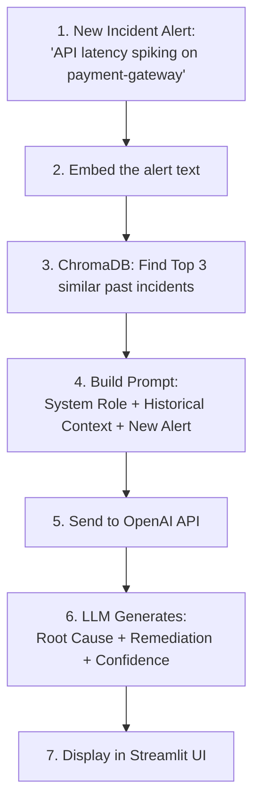

# 04 — OpenAI LLM Root Cause Analysis

In this lab, we connect the Vector Search results (context from ChromaDB) to the **OpenAI API** to automatically generate Root Cause Analysis reports.

---

## The Complete RAG Pipeline



This is the full **Retrieval-Augmented Generation** pipeline:
- **Retrieval** (Steps 1-3): ChromaDB finds semantically similar past incidents
- **Augmentation** (Step 4): We inject the retrieved incidents into the LLM prompt
- **Generation** (Steps 5-6): The LLM writes a structured RCA based on that context

---

## Prerequisites

You will need an OpenAI API key.
1. Sign up at [platform.openai.com](https://platform.openai.com)
2. Navigate to **API Keys** → **Create new secret key**
3. Copy the key (starts with `sk-`)

Update your `.env` file inside the lab directory:
```bash
echo "OPENAI_API_KEY=sk-your-key-here" > /opt/module2-lab/.env
docker compose restart
```

---

## The LLM Engine Code

Open `llm_engine.py` to understand the integration. Here is the full code with explanations:

```python
import os
from openai import OpenAI
from dotenv import load_dotenv

# Load environment variables (like OPENAI_API_KEY) from .env file
load_dotenv()
client = OpenAI()

def generate_rca(current_incident: str, historical_context: list) -> str:
    # 1. Format the historical context into a readable string for the LLM
    context_str = ""
    for idx, incident in enumerate(historical_context):
        context_str += f"\n--- Historical Incident {idx+1} ---"
        context_str += f"\nDescription: {incident['description']}"
        context_str += f"\nRoot Cause: {incident['root_cause']}"
        context_str += f"\nResolution: {incident['resolution']}\n"
        
    # 2. Build the System Prompt (The Persona and Rules)
    system_prompt = """
    You are an expert Site Reliability Engineer (SRE) Assistant. 
    Your job is to analyze new IT incidents and provide a Root Cause Analysis (RCA) 
    and Remediation Plan.
    You will be provided with 'Historical Context' of similar past incidents.
    
    CRITICAL RULE: You must base your RCA strictly on the historical context provided. 
    If the historical context does not seem relevant to the new incident, 
    state that clearly and do not hallucinate a fix.
    """
    
    # 3. Build the User Prompt (The Data)
    user_prompt = f"""
    Please analyze this new incident:
    "{current_incident}"
    
    Here are similar past incidents for context:
    {context_str}
    
    Format your response with the following headers:
    1. **Probable Root Cause**
    2. **Suggested Remediation**
    3. **Confidence Level** (High/Medium/Low based on how closely it matches history)
    """
    
    # 4. Call the OpenAI API
    try:
        response = client.chat.completions.create(
            model="gpt-3.5-turbo",
            messages=[
                {"role": "system", "content": system_prompt},
                {"role": "user", "content": user_prompt}
            ],
            temperature=0.2,
        )
        return response.choices[0].message.content
    except Exception as e:
        return f"Error connecting to LLM: {str(e)}"
```

---

## Key Design Decisions

### Why `temperature=0.2`?

| Temperature | Behavior | Use Case |
|---|---|---|
| 0.0 | Completely deterministic — same input always gives same output | Math, code generation |
| **0.2** | **Mostly deterministic — slight variation for natural language** | **SRE/Ops (our choice)** |
| 0.7 | Creative — generates varied, expressive responses | Marketing copy, chat |
| 1.0 | Maximum randomness — unpredictable | Creative writing, brainstorming |

In IT Operations, we want **facts**, not creativity. A low temperature means the LLM is less likely to hallucinate a dangerous command.

### Why a System Prompt?

The system prompt sets the **persona** and **rules** for the LLM:
- **Persona:** "You are an expert SRE Assistant" → The LLM responds with engineering language
- **Critical Rule:** "base your RCA strictly on the historical context" → Prevents hallucination
- **Escape Hatch:** "state that clearly and do not hallucinate" → If it doesn't know, it says so

### Why Separate System and User Messages?

```python
messages=[
    {"role": "system", "content": system_prompt},   # WHO you are + rules
    {"role": "user", "content": user_prompt}         # WHAT to analyze
]
```

OpenAI's API treats `system` messages as persistent instructions. The `user` message is the specific query. This separation ensures the rules apply to every query without repeating them.

---

## Lab: Test the Full Pipeline

### Test 1: Standard Incident

In the Streamlit UI, enter:
> **"Database connection pool exhausted on billing-api. Users seeing 500 errors."**

Click **Analyze Incident**.

**What to observe:**
1. **Section 1 (Vector Search):** Did ChromaDB find relevant database/connection incidents?
2. **Section 2 (LLM RCA):** Did the LLM generate a structured report with Root Cause, Remediation, and Confidence Level?
3. Is the Remediation actionable? (e.g., "Increase pool size" vs vague "fix the issue")

### Test 2: Vague Alert

Enter:
> **"Something is wrong with the billing system"**

This tests whether the LLM can still generate a useful RCA when the alert is vague. The vector search should find billing-related incidents, and the LLM should note the lower confidence.

### Test 3: Multi-Service Alert

Enter:
> **"Multiple services experiencing high latency. Redis cache eviction rate spiking and API response times above 5 seconds."**

This tests whether the pipeline handles complex, multi-symptom alerts.

---

## API Usage Information

Every API call uses **tokens** (roughly 1 token ≈ 4 characters of English text).

For a typical RCA query:
- System prompt: ~80 tokens
- Historical context (3 incidents): ~200 tokens
- User prompt: ~50 tokens
- LLM response: ~150 tokens
- **Total: ~480 tokens per query**

At `gpt-3.5-turbo` pricing (~$0.50 per 1M tokens), each query costs approximately **$0.00024** (less than a tenth of a cent).

---

## What's Next

The pipeline works! But can we break it? Proceed to **05-break-fix.md** to stress-test the infrastructure with 5 hands-on exercises.
