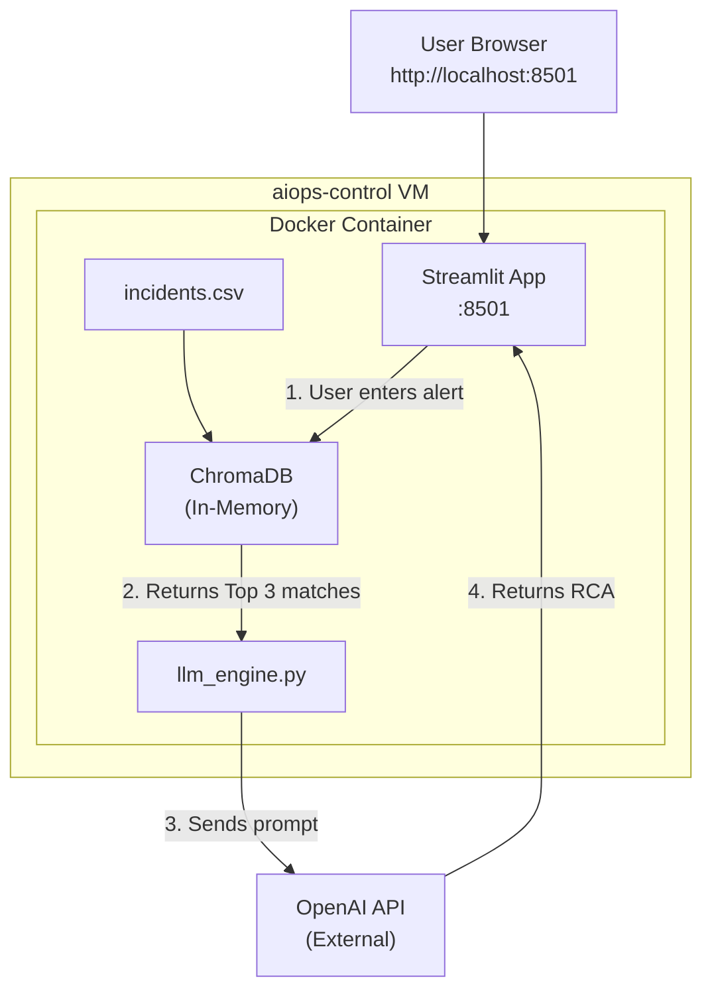

# 07 — Bonus Lecture: AI Hallucinations & Student Deliverables

This is a **student-driven exercise**. You will think like an SRE/Platform Engineer and produce 4 deliverables based on everything you built in Module 2.

---

## Part 1: Understanding AI Hallucinations in SRE

The biggest risk of using LLMs in IT Operations (AIOps) is **Hallucination** — when the AI confidently presents false information as fact.

### Why This is Dangerous in Ops

If an LLM hallucinates a command like `rm -rf /var/log/*` as a "fix" to a disk space issue, an inexperienced engineer might run it and **delete critical audit trails**.

If it confidently says "the root cause is a DNS failure" when the actual cause is a memory leak, the team wastes hours investigating the wrong thing.

### How We Mitigate Hallucinations

In our `llm_engine.py`, we used several techniques:

#### Technique 1: Grounding with RAG

By providing `Historical Context` retrieved from ChromaDB, we ground the LLM in our **actual organizational data**. We aren't asking "How do I fix a database?" — we are asking "How did *we* fix this database *last time*?"

#### Technique 2: Strict System Constraints

```text
CRITICAL RULE: You must base your RCA strictly on the historical context provided. 
If the historical context does not seem relevant to the new incident, 
state that clearly and do not hallucinate a fix.
```

By giving the LLM an explicit **escape hatch** ("state that clearly"), we reduce the chance of it guessing.

#### Technique 3: Temperature Control

```python
temperature=0.2
```

| Temperature | Hallucination Risk | Use Case |
|---|---|---|
| 0.0 | Lowest | Deterministic output (math, code) |
| **0.2** | **Low** | **Engineering analysis (our choice)** |
| 0.5 | Medium | General chat |
| 0.8 | High | Creative writing |
| 1.0 | Highest | Brainstorming |

#### Technique 4: Few-Shot Prompting

If the LLM still returns poorly formatted or inaccurate data, add an **example** inside the prompt:

```text
Here is an example of a perfect response:
---
**Probable Root Cause**: The Redis Cache was too small, leading to high eviction rates.
**Suggested Remediation**: Scale the Redis instance from 2GB to 4GB memory limit.
**Confidence Level**: High — closely matches Historical Incident #2.
---

Now, analyze the following new incident...
```

By showing the LLM exactly what a good response looks like, it mimics that structure and tone.

---

## Part 2: Student Deliverables

Complete the following 4 deliverables. These are the same types of artifacts that real SRE teams produce.

---

### Deliverable 1: Jaccard vs Vector Search Comparison Report

Run these 10 queries through **both** Module 1's Jaccard engine and Module 2's ChromaDB engine. Fill in the results:

| # | Query | Jaccard Top Match | Jaccard Score | ChromaDB Top Match | ChromaDB Distance | Winner |
|---|---|---|---|---|---|---|
| 1 | "database connection pool exhausted" | | | | | |
| 2 | "server running out of memory slowly" | | | | | |
| 3 | "SSL certificate expired on frontend" | | | | | |
| 4 | "users can't log in to the website" | | | | | |
| 5 | "the JVM is struggling with garbage collection" | | | | | |
| 6 | "disk is almost full" | | | | | |
| 7 | "API response times are very slow" | | | | | |
| 8 | "Redis cache keeps losing data" | | | | | |
| 9 | "our web application is throwing 502 errors" | | | | | |
| 10 | "things broke after the latest update" | | | | | |

**Write a 1-paragraph conclusion:** When would you still use Jaccard? When is Vector Search essential?

---

### Deliverable 2: Module 2 RAG Architecture Diagram

Draw the **complete architecture** of your Module 2 environment. This should show the full data flow from user query to LLM response.

**Requirements:**

Your diagram must include:
- [ ] The `aiops-control` VM
- [ ] Docker container(s) running inside the VM
- [ ] The Streamlit UI with port number
- [ ] ChromaDB (in-memory) and how data flows into it
- [ ] The OpenAI API call (external service) with arrows
- [ ] The `incidents.csv` data source
- [ ] The complete RAG flow: Query → Embed → Search → Retrieve → Augment → Generate → Display

**Starter Mermaid Diagram (expand this):**



**Your task**: Expand this into a production-quality architecture diagram using [draw.io](https://app.diagrams.net), [Excalidraw](https://excalidraw.com), or Mermaid.

---

### Deliverable 3: Prompt Engineering Experiment

Experiment with 3 different system prompts to see how they affect RCA quality.

#### Prompt A: Strict (Our Default)
```text
You are an expert SRE. Base your RCA strictly on the historical context. 
If the context is not relevant, state that clearly.
```

#### Prompt B: Relaxed
```text
You are a helpful IT assistant. Analyze the incident and suggest possible fixes.
```

#### Prompt C: Creative
```text
You are an experienced IT consultant. Feel free to speculate on possible causes 
even beyond the provided context. Think broadly.
```

**Run the same query through all 3 prompts:**
> "The payment gateway is returning timeout errors intermittently"

Record the results:

| Prompt | Root Cause Accuracy | Hallucination Risk | Actionability | Best For |
|---|---|---|---|---|
| A (Strict) | _(rate: High/Med/Low)_ | _(rate)_ | _(rate)_ | _(when?)_ |
| B (Relaxed) | _(rate)_ | _(rate)_ | _(rate)_ | _(when?)_ |
| C (Creative) | _(rate)_ | _(rate)_ | _(rate)_ | _(when?)_ |

**Write a 1-paragraph analysis:** Which prompt would you recommend for a production SRE team? Why?

> **Tip:** To test different prompts, temporarily edit `llm_engine.py` inside the container:
> ```bash
> docker compose exec aiops-assistant bash
> vi llm_engine.py  # Edit the system_prompt variable
> exit
> docker compose restart
> ```

---

### Deliverable 4: Cost-Benefit Analysis

Write a **1-page business justification** for deploying this AIOps pipeline in your organization.

**Template:**

```markdown
# AIOps Investment Justification

## Current State
- Number of incidents per day: ___
- Average manual RCA time per incident: ___ minutes
- SRE hourly cost: $___
- Monthly manual RCA cost: $___

## Proposed AIOps Pipeline
- Model: gpt-3.5-turbo / gpt-4o-mini / gpt-4o (choose)
- Estimated monthly API cost: $___
- Setup time: ___ hours
- ChromaDB infrastructure cost: $___

## ROI Calculation
- Monthly savings: $___
- Annual savings: $___
- Payback period: ___

## Non-Financial Benefits
1. ___
2. ___
3. ___

## Risks
1. ___
2. ___

## Recommendation
___
```

---

## Submission Checklist

- [ ] **Jaccard vs Vector comparison table** — 10 queries, filled with actual results
- [ ] **Architecture diagram** — complete with all components, ports, and data flows
- [ ] **Prompt Engineering experiment** — 3 prompts tested, results table filled
- [ ] **Cost-Benefit Analysis** — 1-page business justification with real numbers

---

## Why This Matters

In real SRE teams:
- **Search engine comparisons** justify tool migrations (convincing management to move from Elasticsearch to Vector DBs)
- **Architecture diagrams** are mandatory for every service in the catalog
- **Prompt experiments** are how AI/ML teams optimize their pipelines
- **Cost-benefit analyses** are how you get budget approval for AIOps tooling

These are the artifacts that separate a junior ops engineer from a senior SRE.

---

## Module 2 Complete! 🎉

You have successfully:
1. Understood how text embeddings work and why they beat keyword search
2. Dockerized an AI-powered operations assistant
3. Built a full RAG pipeline: ChromaDB → OpenAI → Automated RCA
4. Stress-tested the pipeline with 5 Break/Fix exercises
5. Calculated the real-world cost of running AI in production
6. Produced 4 professional SRE deliverables

**Next up — Module 3: Deployment — Docker & Kubernetes** where we take this assistant to a Kubernetes cluster!
