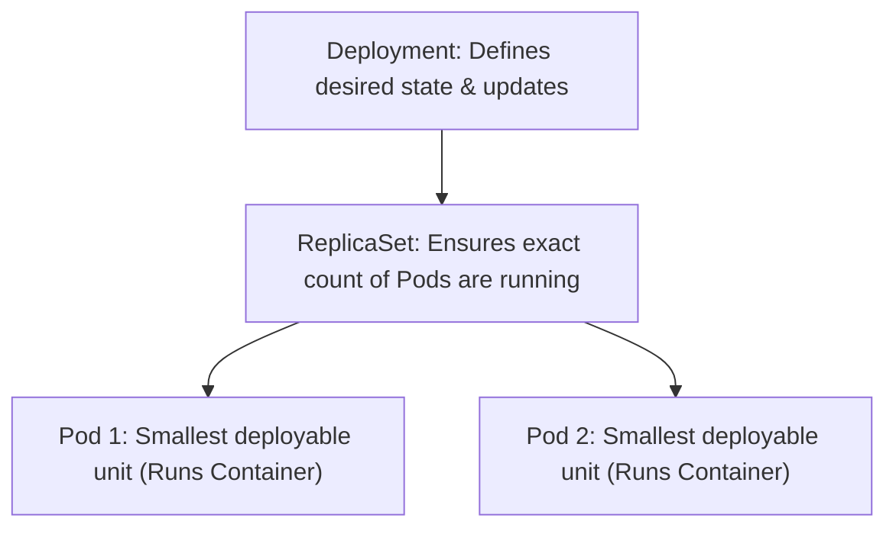

# 01 — From Docker to Kubernetes

In Module 2, you successfully containerized the AIOps assistant. Running it locally via `docker compose` is excellent for development. However, what happens when you deploy to a production environment?

---

## Why Migrate from Docker to Kubernetes?

While Docker provides isolation, running containers in production introduces operational challenges:

| Challenge | Standalone Docker / Compose | Kubernetes (K8s) |
|---|---|---|
| **High Availability** | If the host VM crashes, all containers die. | Automatically reschedules containers onto healthy nodes. |
| **Scaling** | Manual scaling (`docker compose up --scale`). No auto-scaling. | Declarative scaling + Horizontal Pod Autoscaler (HPA). |
| **Service Discovery** | Requires custom DNS / port mapping across nodes. | Native internal DNS (`kube-dns`) and stable Services. |
| **Rolling Updates** | Downtime during container restarts. | Zero-downtime rolling updates with automatic rollbacks. |
| **Resource Management** | Weak controls over noisy neighbors. | Strict CPU/Memory requests & limits per container. |

---

## Core Kubernetes Objects

Kubernetes manages infrastructure declaratively using **manifests** (YAML files). Here are the primary abstractions you will use:



### 1. Pods
A **Pod** is the smallest deployable unit in Kubernetes. It represents a single instance of a running process.
- A Pod can contain one or more containers (usually one primary app container and optional helper "sidecars").
- Containers in a Pod share the same network namespace (they communicate via `localhost`) and storage volumes.
- Pods are **ephemeral** (temporary). They are assigned dynamic IP addresses and can be killed or replaced at any time.

### 2. ReplicaSets
A **ReplicaSet** ensures that a specified number of Pod replicas are running at any given time.
- If a Pod fails or is terminated manually, the ReplicaSet immediately notices the deviation from the desired state and starts a new one.
- You rarely manage ReplicaSets directly; instead, they are managed by **Deployments**.

### 3. Deployments
A **Deployment** provides declarative updates for Pods and ReplicaSets.
- You describe the desired state (e.g., "I want 3 replicas of my Streamlit container using image `aiops-assistant:v1`").
- The Deployment controller changes the actual state to the desired state at a controlled rate, facilitating rolling updates and rollbacks.

---

## Lab: Bootstrapping the Cluster

Let's boot your cluster. We will use the **Vagrant** setup, which spins up a 3-node Kubernetes cluster locally using VirtualBox.

### Step 1: Examine the Vagrantfile

In the `lab/` directory, there is a `Vagrantfile` configured to create:
- **`master`** VM (IP: `192.168.56.24`, RAM: 5GB, CPU: 2)
- **`worker1`** VM (IP: `192.168.56.25`, RAM: 3GB, CPU: 2)
- **`worker2`** VM (IP: `192.168.56.26`, RAM: 3GB, CPU: 2)

During boot, Vagrant runs provisioning scripts that disable swap, install the `containerd` runtime, set up CNI plugins, download Kubernetes packages (`kubelet`, `kubeadm`, `kubectl`), initialize the cluster, deploy the **Flannel** CNI network, and automatically join the workers to the master.

### Step 2: Spin up the Cluster

From your host machine's terminal, run:
```bash
cd Module-3/lab
vagrant up
```
*(This process downloads packages and configures the control plane. It can take up to 10 minutes depending on your internet connection.)*

### Step 3: Verify Cluster Nodes

SSH into the master node and verify that all nodes have successfully joined and are in the `Ready` state:
```bash
vagrant ssh master

# Inside master node VM:
kubectl get nodes
```

Expected output:
```
NAME      STATUS   ROLES           AGE    VERSION
master    Ready    control-plane   5m     v1.30.x
worker1   Ready    <none>          3m     v1.30.x
worker2   Ready    <none>          3m     v1.30.x
```

---

## Lab: Making Your App Image Available to K8s

In a production cluster, Kubernetes pulls container images from a centralized registry (like Docker Hub, GitHub Container Registry, or AWS ECR). Since you built the assistant image locally in Module 2, Kubernetes worker nodes won't find it by default.

Select **one** of the following methods to make the image accessible:

### Method 1: Push to Docker Hub (Easiest)
1. Tag your local Module 2 image with your Docker Hub username:
   ```bash
   docker tag module2-assistant:latest your_dockerhub_username/aiops-assistant:v1
   ```
2. Log in and push the image:
   ```bash
   docker login
   docker push your_dockerhub_username/aiops-assistant:v1
   ```
3. In your Kubernetes deployment YAML, set the image to `your_dockerhub_username/aiops-assistant:v1`.

### Method 2: Load Image into Node Runtime (Registry-Free)
If you do not want to use an external registry, you can export your image as a tarball and load it directly into containerd's namespace on each worker node:
1. On your host machine, export the image:
   ```bash
   docker save module2-assistant:latest > image.tar
   ```
2. Copy the `image.tar` into the synced folder `/vagrant` so the VMs can access it:
   ```bash
   cp image.tar Module-3/lab/
   ```
3. SSH into `worker1` and load the image:
   ```bash
   vagrant ssh worker1
   sudo ctr -n k8s.io images import /vagrant/image.tar
   exit
   ```
4. Repeat the import step on `worker2`:
   ```bash
   vagrant ssh worker2
   sudo ctr -n k8s.io images import /vagrant/image.tar
   exit
   ```

---

## The Deployment Manifest

Let's write your first Kubernetes Deployment manifest. Inside the master node (or your project workspace if using a unified kubeconfig), create a folder named `k8s/` and a file named `assistant-deployment.yaml`.

```yaml
apiVersion: apps/v1
kind: Deployment
metadata:
  name: aiops-assistant-deployment
  labels:
    app: aiops-assistant
spec:
  replicas: 2
  selector:
    matchLabels:
      app: aiops-assistant
  template:
    metadata:
      labels:
        app: aiops-assistant
    spec:
      containers:
      - name: assistant
        image: module2-assistant:latest  # Or your_username/aiops-assistant:v1
        imagePullPolicy: IfNotPresent     # Checks locally before trying to pull
        ports:
        - containerPort: 8501
```

### Spec Breakdown

- **`apiVersion: apps/v1`**: The API version schema we are using for Deployments.
- **`kind: Deployment`**: Tells Kubernetes to create a Deployment resource.
- **`spec.replicas: 2`**: Specifies that we want **2 Pod replicas** running across our worker nodes.
- **`spec.selector.matchLabels`**: Tells the Deployment controller which Pods to manage. It matches the labels defined in the Pod template.
- **`spec.template`**: The blueprint for creating the Pods.
  - **`metadata.labels`**: Labels applied to the Pods. These labels act as targets for services and deployments.
  - **`spec.containers`**: Defines the list of containers running inside the Pod.
    - **`imagePullPolicy: IfNotPresent`**: Crucial for local labs! It tells K8s to look inside the local container runtime (e.g. containerd) for the image before trying to fetch it from the internet.

---

## Applying the Deployment

On the `master` node, run the following commands to create and apply the manifest:

```bash
# Create directory for manifests
mkdir -p /home/vagrant/k8s
```
*(Copy the YAML contents above into `/home/vagrant/k8s/assistant-deployment.yaml`)*

Apply the manifest using `kubectl`:
```bash
kubectl apply -f /home/vagrant/k8s/assistant-deployment.yaml
```

Output:
```
deployment.apps/aiops-assistant-deployment created
```

Check the status of your deployment:
```bash
kubectl get deployments
```

Expected output:
```
NAME                         READY   UP-TO-DATE   AVAILABLE   AGE
aiops-assistant-deployment   2/2     2            2           30s
```

Check the generated Pods:
```bash
kubectl get pods -o wide
```

Expected output:
```
NAME                                          READY   STATUS    RESTARTS   AGE   IP            NODE
aiops-assistant-deployment-55d8f7bf84-ab12d   1/1     Running   0          45s   10.244.1.15   worker1
aiops-assistant-deployment-55d8f7bf84-xy78c   1/1     Running   0          45s   10.244.2.22   worker2
```
Notice that Kubernetes automatically distributed the 2 Pods across both `worker1` and `worker2` to achieve load distribution and fault tolerance!

---

## What's Next

Now that your Pods are running, you cannot access them directly from outside the cluster because their IP addresses (`10.244.x.x`) are internal to the Kubernetes network. In the next lesson, we will configure **Services** and **Ingress** to safely route traffic to our application from our host machine.
