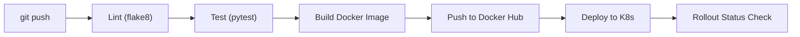

# 01 — CI/CD Pipeline with GitHub Actions

In Module 3, you deployed the AIOps assistant manually by running `kubectl apply` commands from the master node. While this works in a lab, manually deploying to production is dangerous. One typo, one forgotten step, and you can bring the system down. In this lesson, you will build an automated **CI/CD pipeline** using GitHub Actions that runs on every push: linting your code, running your tests, building a Docker image, pushing it to a container registry, and deploying to Kubernetes — all without human intervention.

---

## What is CI/CD?

**Continuous Integration (CI)** and **Continuous Deployment (CD)** are practices that automate the process of getting code from a developer's laptop into production.

| Phase | What Happens | Goal |
|---|---|---|
| **CI (Continuous Integration)** | On every push: code is linted, tests are run, and artifacts (Docker images) are built. | Catch bugs before they reach production. |
| **CD (Continuous Deployment)** | On successful CI: the new artifact is automatically deployed to the staging or production environment. | Ship changes rapidly and reliably. |

The entire sequence is called a **pipeline**:

```
  git push → Lint → Unit Tests → Integration Tests → Build Docker Image → Push to Registry → Deploy to K8s
```

---

## GitHub Actions Fundamentals

GitHub Actions is a CI/CD platform built into GitHub. Workflows are defined as YAML files inside the `.github/workflows/` directory of your repository.

### Key Concepts

| Concept | Description |
|---|---|
| **Workflow** | An automated process defined in a YAML file, triggered by events (push, PR, schedule). |
| **Job** | A set of steps that execute on the same runner (virtual machine). |
| **Step** | A single task within a job: running a script, checking out code, or using an action. |
| **Runner** | The machine that executes the job (GitHub-hosted like `ubuntu-latest`, or self-hosted). |
| **Action** | A reusable unit of code (e.g., `actions/checkout@v4` to clone your repo). |

---

## Lab: Building the CI Pipeline

### Step 1: Create the Workflow File

In your AIOps assistant repository, create the following directory structure and file:

```bash
mkdir -p .github/workflows
```

Create `.github/workflows/ci.yml`:

```yaml
name: AIOps Assistant CI/CD Pipeline

on:
  push:
    branches: [main]
  pull_request:
    branches: [main]

jobs:
  lint:
    name: Lint Code
    runs-on: ubuntu-latest
    steps:
      - name: Checkout Code
        uses: actions/checkout@v4

      - name: Set up Python
        uses: actions/setup-python@v5
        with:
          python-version: '3.11'

      - name: Install linter
        run: pip install flake8

      - name: Run flake8
        run: flake8 app/ --max-line-length=120 --statistics

  test:
    name: Run Tests
    needs: lint
    runs-on: ubuntu-latest
    steps:
      - name: Checkout Code
        uses: actions/checkout@v4

      - name: Set up Python
        uses: actions/setup-python@v5
        with:
          python-version: '3.11'

      - name: Install dependencies
        run: |
          pip install -r requirements.txt
          pip install pytest

      - name: Run unit and integration tests
        run: pytest tests/ -v --tb=short

  build:
    name: Build & Push Docker Image
    needs: test
    runs-on: ubuntu-latest
    if: github.event_name == 'push' && github.ref == 'refs/heads/main'
    steps:
      - name: Checkout Code
        uses: actions/checkout@v4

      - name: Log in to Docker Hub
        uses: docker/login-action@v3
        with:
          username: ${{ secrets.DOCKER_USERNAME }}
          password: ${{ secrets.DOCKER_PASSWORD }}

      - name: Build and push Docker image
        uses: docker/build-push-action@v5
        with:
          context: .
          push: true
          tags: |
            ${{ secrets.DOCKER_USERNAME }}/aiops-assistant:${{ github.sha }}
            ${{ secrets.DOCKER_USERNAME }}/aiops-assistant:latest

  deploy:
    name: Deploy to Kubernetes
    needs: build
    runs-on: ubuntu-latest
    if: github.event_name == 'push' && github.ref == 'refs/heads/main'
    environment: production
    steps:
      - name: Checkout Code
        uses: actions/checkout@v4

      - name: Set up kubectl
        uses: azure/setup-kubectl@v3

      - name: Configure kubeconfig
        run: |
          mkdir -p $HOME/.kube
          echo "${{ secrets.KUBE_CONFIG }}" | base64 -d > $HOME/.kube/config

      - name: Update deployment image
        run: |
          kubectl set image deployment/aiops-assistant-deployment \
            assistant=${{ secrets.DOCKER_USERNAME }}/aiops-assistant:${{ github.sha }}

      - name: Wait for rollout to complete
        run: kubectl rollout status deployment/aiops-assistant-deployment --timeout=120s
```

### Step 2: Understanding the Pipeline Flow



Each job has a `needs` dependency, meaning:
- **`test`** will not run unless **`lint`** passes.
- **`build`** will not run unless **`test`** passes.
- **`deploy`** will not run unless **`build`** passes.

If any step fails, the entire pipeline **stops**, preventing broken code from reaching production.

### Step 3: Configure GitHub Secrets

Navigate to your GitHub repository → **Settings** → **Secrets and variables** → **Actions**, and create the following secrets:

| Secret Name | Value |
|---|---|
| `DOCKER_USERNAME` | Your Docker Hub username |
| `DOCKER_PASSWORD` | Your Docker Hub access token (not your password — generate a token at [hub.docker.com/settings/security](https://hub.docker.com/settings/security)) |
| `KUBE_CONFIG` | Base64-encoded kubeconfig from your cluster master node (`cat ~/.kube/config \| base64 -w 0`) |

### Step 4: The Manual Approval Gate

Notice the `environment: production` line in the deploy job. In GitHub, you can configure **Environment Protection Rules** that require a manual approval before deployment proceeds:

1. Go to **Settings** → **Environments** → **New environment** → Name it `production`.
2. Check **Required reviewers** and add yourself (or a teammate).
3. Now when the pipeline reaches the `deploy` job, it will pause and wait for a human to click **"Approve"** before deploying to the cluster.

This is a critical safety net for production systems!

---

## Understanding Pipeline Dependencies

The `needs` keyword creates a **Directed Acyclic Graph (DAG)** of job dependencies:

| Job | Depends On | Runs When |
|---|---|---|
| `lint` | — | Every push and PR |
| `test` | `lint` | Only if lint passes |
| `build` | `test` | Only on `main` branch push, after tests pass |
| `deploy` | `build` | Only on `main` branch push, after image is built |

---

## What's Next

You have a pipeline, but it runs `pytest tests/` — and the `tests/` directory doesn't exist yet! In the next lesson, we will write **5 automated tests** covering unit tests, integration tests, and a golden dataset ML accuracy test.
